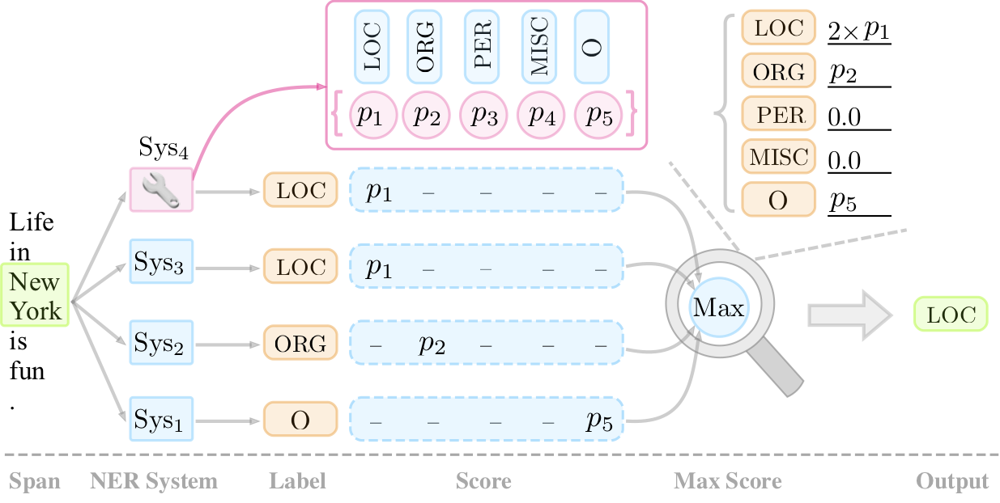
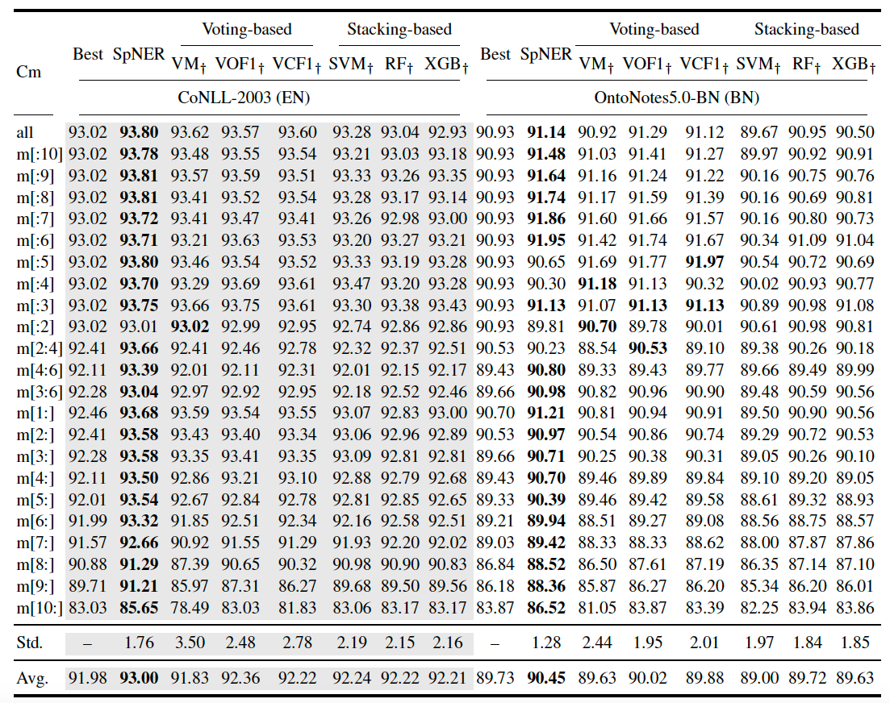

## SpanNER: Named EntityRe-/Recognition as Span Prediction
[**Overview**](https://hub.fastgit.org/neulab/SpanNER#overview) | 
[**Demo**](https://hub.fastgit.org/neulab/SpanNER#demo) | 
[**Installation**](https://hub.fastgit.org/neulab/SpanNER#quick-installation) |
[**Preprocessing**](https://hub.fastgit.org/neulab/SpanNER#data-preprocessing) |
[**Prepare Models**](https://hub.fastgit.org/neulab/SpanNER#prepare-models) |
[**Running**](https://hub.fastgit.org/neulab/SpanNER#how-to-run) |
[**System Combination**](https://hub.fastgit.org/neulab/SpanNER#system-combination) |
[**Bib**](https://hub.fastgit.org/neulab/SpanNER#bib)

This repository contains the code for our paper [SpanNER: Named EntityRe-/Recognition as Span Prediction](https://arxiv.org/pdf/2106.00641v1.pdf) (ACL 2021).

The model designed in this work has been deployed into [ExplainaBoard](http://explainaboard.nlpedia.ai/leaderboard/task-ner/index.php).

## Overview

We investigate complementary advantages of systems based on different paradigms: span prediction model and sequence labeling framework. We then reveal that span prediction, simultaneously, can serve as a system combiner to re-recognize named entities from different systems’ outputs. We experimentally implement 154 systems on 11 datasets, covering three languages. Comprehensive results show the effectiveness of span prediction models that serve as base NER systems and system combiners.

<!-- Two roles of span prediction models (boxes in blue): 
* as a base NER system 
* as a system combiner. -->

<div  align="center">
 
</div>

## Demo

We deploy SpanNER into the [ExplainaBoard](http://explainaboard.nlpedia.ai/leaderboard/task-ner/index.php).
<div  align="center">
 
</div>


## Quick Installation

- `python3`
- `PyTorch`
- `pytorch-lightning`

Run the following script to install the dependencies,
```
pip3 install -r requirements.txt
```


## Data Preprocessing

The dataset needs to be preprocessed, before running the model.
We provide `dataprocess/bio2spannerformat.py` for reference, which gives the CoNLL-2003 as an example. 
First, you need to download datasets, and then convert them into BIO2 tagging format. We provided the CoNLL-2003 dataset with BIO format in the `data/conll03_bio` folder and its preprocessed format dataset in the `data/conll03` folder.

The download links of the datasets used in this work are shown as follows:
- [CoNLL-2003](https://www.clips.uantwerpen.be/conll2003/ner/)
- [CoNLL-2002](https://www.clips.uantwerpen.be/conll2002/ner/)
- [OntoNotes 5.0](https://catalog.ldc.upenn.edu/LDC2013T19)
- [WNUT-2016](http://noisy-text.github.io/2016/ner-shared-task.html)
- [WNUT-2017](http://noisy-text.github.io/2017/emerging-rare-entities.html)


## Prepare Models

For English Datasets, we use [BERT-Large](https://github.com/google-research/bert).

For Dutch and Spanish Datasets, we use [BERT-Multilingual-Base](https://huggingface.co/bert-base-multilingual-uncased).


## How to Run?

Here, we give CoNLL-2003 as an example. You may need to change the `DATA_DIR`, `PRETRAINED`, `dataname`, and `n_class` to your own dataset path, pre-trained model path, dataset name, and the number of labels in the dataset, respectively.

```
./run_conll03_spanner.sh
```


## System Combination

### Base Model
We provided 12 base models (result-files) of the CoNLL-2003 dataset in `combination/results`.
More base models (result-files) can be downloaded from [ExplainaBoard-download](http://explainaboard.nlpedia.ai/download.html).

### Combination
Put your different base models (result-files) in the `data/results` folder, then run:

```
python comb_voting.py
```

Here, we provided four system combination methods, including: 

- SpanNER, 
- Majority voting (VM), 
- Weighted voting based on overall F1-score (VOF1), 
- Weighted voting based on class F1-score (VCF1).

### Results at a Glance
<div  align="center">
 
</div>


## Bib

```
@article{fu2021spanner,
  title={SpanNer: Named Entity Re-/Recognition as Span Prediction},
  author={Fu, Jinlan and Huang, Xuanjing and Liu, Pengfei},
  journal={arXiv preprint arXiv:2106.00641},
  year={2021}
}
```


